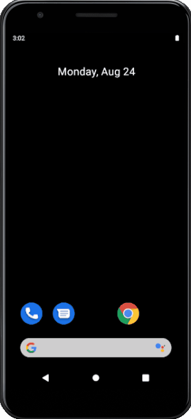

# Introduction
We can use this React Native app to get access token, and send request for validating access token.
- The "Validate API" button will send an access token from AsyncStorage to Verify Token API, and
show the response message of Verify Token API.
- The "Refresh Token" button will try to refresh access token firstly.
  + if the operation is successful, then send the new access token to Verify Token API and show the response message.
  + if the operation is unsuccessful, then send access token from AsyncStorage to Verify Token API and show the response message.



# How to run the app on Android simulator
- Please install the following tools:
  + React Native CLI
    * https://reactnative.dev/docs/0.61/getting-started
  + Android Studio
- Please open the project root folder in a cmd shell. Then run the following commands.
  + ```
    npm install
    ```
  + ```
    npx react-native run-android
    ```
- After the commands executing successful, you can use this app on the simulator.

# Important dependencies
- npm install react-native-app-auth@5.1.1
  + We can use react-native-app-auth to handle authentication and token.
- npm install @react-native-community/async-storage@1.9.0
  + We can use async-storage to provide storage.

# Tips
- You can read the following files for more information.
  + screens\HomeScreen.tsx
  + auth\AuthManager.ts
- If the audience ("aud") of an access token is Verify Token API, then Verify Token API can validate the signature of the token.
- If the audience of an access token is not Verify Token API, it is not suggested that Verify Token API validate the signature. Because it's not safety.
- So if we hope this React Native app can use Verify Token API, we would better be careful with some API/Permissions which will be added to app scopes, please make sure the audience ("aud") of access tokens is Verify Token API.